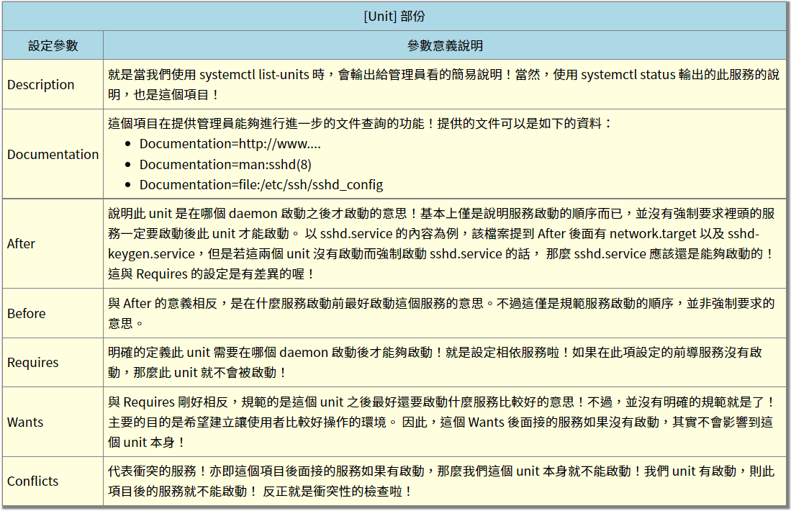
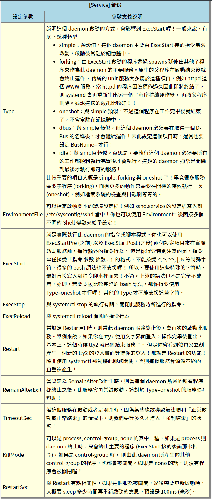
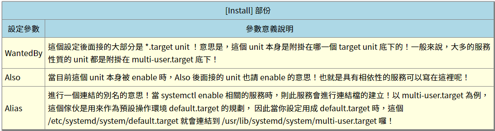

```Text
Author: Antony_Weng <weng851107@gmail.com>

This file is only used for the record of the learning process, only used by myself and the file has never been leaked out.
If there is related infringement or violation of related regulations, please contact me and the related files will be deleted immediately. Thank you!
```

# 目錄

- [範例](#0)
  - [serial-getty@.service](#0.1)
- [Service內容簡介](#1)
  - [一.開機啟動](#1.1)
  - [二.啟動服務](#1.2)
  - [三.停止服務](#1.3)
  - [四.讀懂配置文件](#1.4)
  - [五.[Unit] 區塊：啟動順序與依賴關係。](#1.5)
  - [六.[Service] 區塊：啟動行為](#1.6)
    - [6.1 啟動命令](#1.6.1)
    - [6.2 啟動類型](#1.6.2)
    - [6.3 重啟行為](#1.6.3)
  - [七.[Install] 區塊](#1.7)
  - [八.Target 的配置文件](#1.8)
  - [九.修改配置文件後重啟](#1.9)
- [認識系統服務 (daemons)](#2)
  - [什麼是 daemon 與服務 (service)](#2.1)
  - [透過 systemctl 管理服務](#2.2)
    - [daemon的狀態](#2.2.1)
    - [透過 systemctl 管理不同的操作環境 (target unit)](#2.2.2)
    - [透過 systemctl 分析各服務之間的相依性](#2.2.3)
    - [systemctl 設定檔簡介](#2.2.4)


<h1 id="0">範例</h1>

<h2 id="0.1">serial-getty@.service</h2>

自動登陸：serial-getty@.service 中把 /sbin/agetty 後面帶的參數加上 `-a root` or `--autologin root`

```bash
chicony@ubuntu:/$ /sbin/agetty 

Usage:
 agetty [options] <line> [<baud_rate>,...] [<termtype>]
 agetty [options] <baud_rate>,... <line> [<termtype>]

Open a terminal and set its mode.

Options:
 -8, --8bits                assume 8-bit tty
 -a, --autologin <user>     login the specified user automatically
 -c, --noreset              do not reset control mode
 -E, --remote               use -r <hostname> for login(1)
 -f, --issue-file <file>    display issue file
 -h, --flow-control         enable hardware flow control
 -H, --host <hostname>      specify login host
 -i, --noissue              do not display issue file
 -I, --init-string <string> set init string
 -J  --noclear              do not clear the screen before prompt
 -l, --login-program <file> specify login program
 -L, --local-line[=<mode>]  control the local line flag
 -m, --extract-baud         extract baud rate during connect
 -n, --skip-login           do not prompt for login
 -N  --nonewline            do not print a newline before issue
 -o, --login-options <opts> options that are passed to login
 -p, --login-pause          wait for any key before the login
 -r, --chroot <dir>         change root to the directory
 -R, --hangup               do virtually hangup on the tty
 -s, --keep-baud            try to keep baud rate after break
 -t, --timeout <number>     login process timeout
 -U, --detect-case          detect uppercase terminal
 -w, --wait-cr              wait carriage-return
     --nohints              do not print hints
     --nohostname           no hostname at all will be shown
     --long-hostname        show full qualified hostname
     --erase-chars <string> additional backspace chars
     --kill-chars <string>  additional kill chars
     --chdir <directory>    chdir before the login
     --delay <number>       sleep seconds before prompt
     --nice <number>        run login with this priority
     --reload               reload prompts on running agetty instances
     --help                 display this help and exit
     --version              output version information and exit
```

在getty.target.wants產生連結檔


<h1 id="1">Service內容簡介</h1>

<h2 id="1.1">一.開機啟動</h2>

對於那些支持 Systemd 的軟件，安裝的時候，會自動在/usr/lib/systemd/system目錄添加一個配置文件。如果你想讓該軟件開機啟動，就執行下面的命令（以httpd.service為例）。

```Shell
$ sudo systemctl enable httpd
```

上面的命令相當於在 /etc/systemd/system/ 目錄增加一個 link，指向 /usr/lib/systemd/system/ 裡面的 httpd.service 文件。
這是因為開機時，Systemd 只執行 /etc/systemd/system 目錄裡的設定文件。
這也意味著，如果把修改後的配置文件放在該目錄，就可以達到覆蓋原始配置的效果。

反之關閉開機啟動的指令為

```bash
$ sudo systemctl disable httpd
```

<h2 id="1.2">二.啟動服務</h2>

設置開機啟動以後，軟件並不會立即啟動，必須等到下一次開機。

如果想現在就運行該軟件，那麽要執行 systemctl start 命令。

```Shell
$ systemctl start httpd
```
執行上面的命令以後，有可能啟動失敗，因此要用 systemctl status 命令查看一下該服務的狀態。

```Shell
$ systemctl status httpd

httpd.service - The Apache HTTP Server
   Loaded: loaded (/usr/lib/systemd/system/httpd.service; enabled)
   Active: active (running) since 金 2014-12-05 12:18:22 JST; 7min ago
 Main PID: 4349 (httpd)
   Status: "Total requests: 1; Current requests/sec: 0; Current traffic:   0 B/sec"
   CGroup: /system.slice/httpd.service
           ├─4349 /usr/sbin/httpd -DFOREGROUND
           ├─4350 /usr/sbin/httpd -DFOREGROUND
           ├─4351 /usr/sbin/httpd -DFOREGROUND
           ├─4352 /usr/sbin/httpd -DFOREGROUND
           ├─4353 /usr/sbin/httpd -DFOREGROUND
           └─4354 /usr/sbin/httpd -DFOREGROUND

12月 05 12:18:22 localhost.localdomain systemd[1]: Starting The Apache HTTP Server...
12月 05 12:18:22 localhost.localdomain systemd[1]: Started The Apache HTTP Server.
12月 05 12:22:40 localhost.localdomain systemd[1]: Started The Apache HTTP Server.
```

上面的輸出結果含義如下:

- Loaded ：配置文件的位置，是否設為開機啟動
- Active：表示正在運行
- Main PID：主進程ID
- Status：由應用本身（ 這裡是 httpd ）提供的軟件當前狀態
- CGroup：應用的所有子進程
- 日誌：應用的日誌

<h2 id="1.3">三.停止服務</h2>

終止正在運行的服務，需要執行systemctl stop命令。

```Shell
$ systemctl stop httpd.service
```

有時候，該命令可能沒有響應，服務停不下來。這時候就不得不 "kill proccess" 了，向正在運行的進程發出 kill 信號。

```Shell
$ systemctl kill httpd.service
```

此外，重啟服務要執行 systemctl restart 命令。

```Shell
$ systemctl restart httpd.service
```

<h2 id="1.4">四.讀懂配置文件</h2>

一個服務怎麽啟動，完全由它的配置文件決定。下面就來看，配置文件有些什麽內容。

前面說過，設定文件主要放在 /usr/lib/systemd/system 目錄，也可能在 /etc/systemd/system 目錄。
找到設定文件以後，使用 vim or nano 打開即可。

systemctl cat 命令可以用來查看設定文件，下面以 sshd.service 文件為例，它的作用是啟動一個 SSH 伺服器，供其他用戶以 SSH 方式登錄。

```Shell
$ systemctl cat sshd.service

[Unit]
Description=OpenSSH server daemon
Documentation=man:sshd(8) man:sshd_config(5)
After=network.target sshd-keygen.service
Wants=sshd-keygen.service

[Service]
EnvironmentFile=/etc/sysconfig/sshd
ExecStart=/usr/sbin/sshd -D $OPTIONS
ExecReload=/bin/kill -HUP $MAINPID
Type=simple
KillMode=process
Restart=on-failure
RestartSec=42s

[Install]
WantedBy=multi-user.target
```

可以看到，配置文件分成幾個區塊，每個區塊包含若干條鍵值對。
下面依次解釋每個區塊的內容。

<h2 id="1.5">五.[Unit] 區塊：啟動順序與依賴關係。</h5>

Unit 區塊的 Description 字段給出當前服務的簡單描述，Documentation 字段給出文檔位置。
接下來的設置是啟動順序和依賴關系，這個比較重要。

After 字段：表示如果 network.target 或 sshd-keygen.service 需要啟動，那麽 sshd.service 應該在它們之後啟動。
相應地，還有一個 Before 字段，定義 sshd.service 應該在哪些服務之前啟動。
注意：After 和 Before 字段只涉及啟動順序，不涉及依賴關系。

舉例來說，某 Web 應用需要 postgresql 數據庫儲存數據。
在配置文件中，它只定義要在 postgresql 之後啟動，而沒有定義依賴 postgresql 。
上線後，由於某種原因，postgresql 需要重新啟動，在停止服務期間，該 Web 應用就會無法建立數據庫連接。

設置依賴關系，需要使用 Wants 字段和 Requires 字段。

Wants 字段：表示 sshd.service 與 sshd-keygen.service 之間存在【弱依賴】關系。
即如果 "sshd-keygen.service" 啟動失敗或停止運行，不影響 sshd.service 繼續執行。

Requires字段則表示【強依賴】關系，即如果該服務啟動失敗或異常退出，那麽 sshd.service 也必須退出。

注意：Wants 字段與 Requires 字段只涉及依賴關系，與啟動順序無關，默認情況下是同時啟動的。

<h2 id="1.6">六.[Service] 區塊：啟動行為</h2>

Service區塊定義如何啟動當前服務。

<h3 id="1.6.1">6.1 啟動命令</h3>

許多軟件都有自己的環境參數文件，該文件可以用EnvironmentFile字段讀取。

EnvironmentFile 字段：指定當前服務的環境參數文件。
該文件內部的 key=value 鍵值對，可以用 $key 的形式，在當前配置文件中獲取。

上面的例子中，sshd 的環境參數文件是 /etc/sysconfig/sshd。

配置文件裏面最重要的字段是 ExecStart。
ExecStart字段：定義啟動進程時執行的命令。

上面的例子中，啟動sshd，執行的命令是 /usr/sbin/sshd -D $OPTIONS，其中的變量 $OPTIONS 就來自 EnvironmentFile 字段指定的環境參數文件。

與之作用相似的，還有如下這些字段：

- ExecReload 字段：重啟服務時執行的命令
- ExecStop 字段：停止服務時執行的命令
- ExecStartPre 字段：啟動服務之前執行的命令
- ExecStartPost 字段：啟動服務之後執行的命令
- ExecStopPost 字段：停止服務之後執行的命令

請看下面的例子。

```Shell
[Service]
ExecStart=/bin/echo execstart1
ExecStart=
ExecStart=/bin/echo execstart2
ExecStartPost=/bin/echo post1
ExecStartPost=/bin/echo post2
```

上面這個配置文件，第二行 ExecStart 設為空值，等於取消了第一行的設置，運行結果如下。

```Shell
execstart2
post1
post2
```

所有的啟動設置之前，都可以加上一個連詞號（-），表示【抑制錯誤】。
即發生錯誤的時候，不影響其他命令的執行。
比如，EnvironmentFile=-/etc/sysconfig/sshd（注意等號後面的那個連詞號），就表示即使 /etc/sysconfig/sshd 文件不存在，也不會拋出錯誤。

<h3 id="1.6.2">6.2 啟動類型</h3>

Type 字段定義啟動類型。它可以設置的值如下。

- simple（默認值）：ExecStart 字段啟動的進程為主進程
- forking：ExecStart 字段將以 fork() 方式啟動，此時父進程將會退出，子進程將成為主進程
- oneshot：類似於 simple，但只執行一次，Systemd 會等它執行完，才啟動其他服務
- dbus：類似於 simple，但會等待 D-Bus 信號後啟動
- notify：類似於 simple，啟動結束後會發出通知信號，然後 Systemd 再啟動其他服務
- idle：類似於 simple，但是要等到其他任務都執行完，才會啟動該服務。一種使用場合是為讓該服務的輸出，不與其他服務的輸出相混合

下面是一個 oneshot 的例子，筆記本電腦啟動時，要把觸摸板關掉，配置文件可以這樣寫：

```Shell
[Unit]
Description=Switch-off Touchpad

[Service]
Type=oneshot
ExecStart=/usr/bin/touchpad-off

[Install]
WantedBy=multi-user.target
```

上面的配置文件，啟動類型設為oneshot，就表明這個服務只要運行一次就夠了，不需要長期運行。
如果關閉以後，將來某個時候還想打開，配置文件修改如下：

```Shell
[Unit]
Description=Switch-off Touchpad

[Service]
Type=oneshot
ExecStart=/usr/bin/touchpad-off start
ExecStop=/usr/bin/touchpad-off stop
RemainAfterExit=yes

[Install]
WantedBy=multi-user.target
```

上面配置文件中，RemainAfterExit 字段設為 yes，表示進程退出以後，服務仍然保持執行。
這樣的話，一旦使用 systemctl stop 命令停止服務，ExecStop 指定的命令就會執行，從而重新開啟觸摸板。

<h3 id="1.6.3">6.3 重啟行為</h3>

Service區塊有一些字段，定義了重啟行為。

KillMode 字段：定義 Systemd 如何停止 sshd 服務。

上面這個例子中，將 KillMode 設為 process，表示只停止主進程，不停止任何sshd 子進程。
即子進程打開的 SSH session 仍然保持連接。這個設置不太常見，但對 sshd 很重要，否則你停止服務的時候，會連自己打開的 SSH session 一起殺掉。

KillMode 字段可以設置的值如下：

- control-group（默認值）：當前控制組裏面的所有子進程，都會被殺掉
- process：只殺主進程
- mixed：主進程將收到 SIGTERM 信號，子進程收到 SIGKILL 信號
- none：沒有進程會被殺掉，只是執行服務的 stop 命令。

接下來是 Restart 字段。
Restart字段：定義了 sshd 退出後，Systemd 的重啟方式。
上面的例子中，Restart 設為 on-failure，表示任何意外的失敗，就將重啟 sshd。如果 sshd 正常停止（比如執行systemctl stop命令），它就不會重啟。

Restart 字段可以設置的值如下：

- no（默認值）：退出後不會重啟
- on-success：只有正常退出時（退出狀態碼為0），才會重啟
- on-failure：非正常退出時（退出狀態碼非0），包括被信號終止和超時，才會重啟
- on-abnormal：只有被信號終止和超時，才會重啟
- on-abort：只有在收到沒有捕捉到的信號終止時，才會重啟
- on-watchdog：超時退出，才會重啟
- always：不管是什麽退出原因，總是重啟

對於守護進程，推薦設為 on-failure。對於那些允許發生錯誤退出的服務，可以設為 on-abnormal。

最後是 RestartSec 字段。
RestartSec 字段：表示 Systemd 重啟服務之前，需要等待的秒數。上面的例子設為等待42秒。

<h2 id="1.7">七.[Install] 區塊</h2>

Install 區塊，定義如何安裝這個配置文件，即怎樣做到開機啟動。

WantedBy 字段：表示該服務所在的 Target。

Target 的含義是服務組，表示一組服務。WantedBy=multi-user.target 指的是，sshd 所在的 Target 是 multi-user.target。

這個設置非常重要，
因為執行 systemctl enable sshd.service 命令時，sshd.service 的一個符號鏈接，
就會放在 /etc/systemd/system 目錄下面的multi-user.target.wants子目錄之中。

Systemd 有默認的啟動 Target。

```Shell
$ systemctl get-default multi-user.target
```

上面的結果表示，默認的啟動 Target 是 multi-user.target。
在這個組裏的所有服務，都將開機啟動。這就是為什麽 systemctl enable 命令能設置開機啟動的原因。

使用 Target 的時候，systemctl list-dependencies 命令和 systemctl isolate 命令也很有用。

```Shell
# 查看 multi-user.target 包含的所有服務
$ systemctl list-dependencies multi-user.target
```

```Shell
# 切換到另一個 target
# shutdown.target 就是關機狀態
$ systemctl isolate shutdown.target
```

一般來說，常用的 Target 有兩個：一個是multi-user.target，表示多用戶命令行狀態；另一個是graphical.target，表示圖形用戶狀態，它依賴於multi-user.target。官方文檔有一張非常清晰的 Target 依賴關系圖。

<h2 id="1.8">八.Target 的配置文件</h2>

Target 也有自己的配置文件。

```Shell
$ systemctl cat multi-user.target

[Unit]
Description=Multi-User System
Documentation=man:systemd.special(7)
Requires=basic.target
Conflicts=rescue.service rescue.target
After=basic.target rescue.service rescue.target
AllowIsolate=yes
```

注意，Target 配置文件裏面沒有啟動命令。

上面輸出結果中，主要字段含義如下。

- Requires 字段：要求 basic.target 一起運行。
- Conflicts 字段：沖突字段。如果 rescue.service 或 rescue.target 正在運行，multi-user.target 就不能運行，反之亦然。
- After：表示 multi-user.target 在 basic.target 、 rescue.service、 rescue.target 之後啟動，如果它們有啟動的話。
- AllowIsolate：允許使用 systemctl isolate 命令切換到 multi-user.target。

<h2 id="1.9">九.修改配置文件後重啟</h2>

修改配置文件以後，需要重新加載配置文件，然後重新啟動相關服務。

```Shell
# 重新加載配置文件
$ systemctl daemon-reload

# 重啟相關服務
$ systemctl restart foobar
```

<h1 id="2">認識系統服務 (daemons)</h1>

<h2 id="2.1">什麼是 daemon 與服務 (service)</h2>

系統為了某些功能必須要提供一些服務 (不論是系統本身還是網路方面)，這個服務就稱為 service。但是 service 的提供總是需要程式的運作吧！否則如何執行呢？所以達成這個 service 的程式我們就稱呼他為 daemon 

達成某個服務是需要一支 daemon 在背景中運作， 沒有這支 daemon 就不會有 service 

[早期 System V 的 init 管理行為中 daemon 的主要分類 (Optional)](https://linux.vbird.org/linux_basic/centos7/0560daemons.php#daemon:~:text=17.1.1%20%E6%97%A9%E6%9C%9F%20System%20V%20%E7%9A%84%20init%20%E7%AE%A1%E7%90%86%E8%A1%8C%E7%82%BA%E4%B8%AD%20daemon%20%E7%9A%84%E4%B8%BB%E8%A6%81%E5%88%86%E9%A1%9E%20(Optional))

與 systemd 的 daemon 運作過程相關的目錄簡介
- `/usr/lib/systemd/system/`：預設的啟動腳本設定檔都放在這裡，這裡的資料盡量不要修改～ 要修改時，請到 /etc/systemd/system 底下修改較佳
- `/run/systemd/system/`：系統執行過程中所產生的服務腳本，這些腳本的優先序要比 /usr/lib/systemd/system/ 高！
- `/etc/systemd/system/`：管理員依據主機系統的需求所建立的執行腳本，其實這個目錄有點像以前 /etc/rc.d/rc5.d/Sxx 之類的功能！執行優先序又比 /run/systemd/system/ 高喔！
- `/etc/sysconfig/*`：幾乎所有的服務都會將初始化的一些選項設定寫入到這個目錄下
- `/var/lib/`：一些會產生資料的服務都會將他的資料寫入到 /var/lib/ 目錄中。
- `/run/`：放置了好多 daemon 的暫存檔

systemd 使用的 unit 分類
- systemd 將過去所謂的 daemon 執行腳本通通稱為一個服務單位 (unit)，而每種服務單位依據功能來區分時，就分類為不同的類型 (type)。
- 基本的類型有包括系統服務、資料監聽與交換的插槽檔服務 (socket)、儲存系統狀態的快照類型、提供不同類似執行等級分類的操作環境 (target) 等等。

<h2 id="2.2">透過 systemctl 管理服務</h2>

systemd 這個啟動服務的機制，主要是透過 systemctl 的指令來處理的。跟以前 systemV 需要 service / chkconfig / setup / init 等指令來協助不同

```bash
[root@study ~]# systemctl [command] [unit]
command 主要有：
start     ：立刻啟動後面接的 unit
stop      ：立刻關閉後面接的 unit
restart   ：立刻關閉後啟動後面接的 unit，亦即執行 stop 再 start 的意思
reload    ：不關閉後面接的 unit 的情況下，重新載入設定檔，讓設定生效
enable    ：設定下次開機時，後面接的 unit 會被啟動
disable   ：設定下次開機時，後面接的 unit 不會被啟動
status    ：目前後面接的這個 unit 的狀態，會列出有沒有正在執行、開機預設執行否、登錄等資訊等！
is-active ：目前有沒有正在運作中
is-enabled：開機時有沒有預設要啟用這個 unit
```

<h3 id="2.2.1">daemon的狀態</h3>

daemon基本上有幾個常見的狀態：
- active (running)：正有一隻或多隻程序正在系統中執行的意思
- active (exited)：僅執行一次就正常結束的服務，目前並沒有任何程序在系統中執行。
- active (waiting)：正在執行當中，不過還再等待其他的事件才能繼續處理。
- inactive：這個服務目前沒有運作的意思。

daemon 的預設狀態：
- enabled：這個 daemon 將在開機時被執行
- disabled：這個 daemon 在開機時不會被執行
- static：這個 daemon 不可以自己啟動 (enable 不可)，不過可能會被其他的 enabled 的服務來喚醒 (相依屬性的服務)
- mask：這個 daemon 無論如何都無法被啟動！因為已經被強制註銷 (非刪除)。可透過 systemctl unmask 方式改回原本狀態

透過 systemctl 觀察系統上所有的服務

```bash
[root@study ~]# systemctl [command] [--type=TYPE] [--all]
command:
    list-units      ：依據 unit 列出目前有啟動的 unit。若加上 --all 才會列出沒啟動的。
    list-unit-files ：依據 /usr/lib/systemd/system/ 內的檔案，將所有檔案列表說明。
    --type=TYPE：就是之前提到的 unit type，主要有 service, socket, target 等
```

<h3 id="2.2.2">透過 systemctl 管理不同的操作環境 (target unit)</h3>

正常的模式是 `multi-user.target` 以及 `graphical.target` 兩個
- graphical.target：就是文字加上圖形界面，這個項目已經包含了底下的 multi-user.target 項目！
- multi-user.target：純文字模式！

如何知道目前的模式是哪一種？

    ```bash
    [root@study ~]# systemctl [command] [unit.target]
    選項與參數：
    command:
        get-default ：取得目前的 target 
        set-default ：設定後面接的 target 成為預設的操作模式
        isolate     ：切換到後面接的模式

    範例一：我們的測試機器預設是圖形界面，先觀察是否真為圖形模式，再將預設模式轉為文字界面
    [root@study ~]# systemctl get-default 
    graphical.target  # 果然是圖形界面喔！

    [root@study ~]# systemctl set-default multi-user.target
    [root@study ~]# systemctl get-default 
    multi-user.target

    範例二：在不重新開機的情況下，將目前的操作環境改為純文字模式，關掉圖形界面
    [root@study ~]# systemctl isolate multi-user.target

    範例三：若需要重新取得圖形界面呢？
    [root@study ~]# systemctl isolate graphical.target
    ```

在 service 部份用 start/stop/restart 才對，在 target 項目則請使用 isolate (隔離不同的操作模式)

systemd 也提供了數個簡單的指令給我們切換操作模式之用

```bash
[root@study ~]# systemctl poweroff  系統關機
[root@study ~]# systemctl reboot    重新開機
[root@study ~]# systemctl suspend   進入暫停模式
[root@study ~]# systemctl hibernate 進入休眠模式
[root@study ~]# systemctl rescue    強制進入救援模式
[root@study ~]# systemctl emergency 強制進入緊急救援模式
```

<h3 id="2.2.3">透過 systemctl 分析各服務之間的相依性</h3>

```bash
[root@study ~]# systemctl list-dependencies [unit] [--reverse]
選項與參數：
--reverse ：反向追蹤誰使用這個 unit 的意思！

# 列出目前的 target 環境下，用到什麼特別的 unit 
[root@study ~]# systemctl get-default
multi-user.target

[root@study ~]# systemctl list-dependencies --reverse
default.target
└─graphical.target

[root@study ~]# systemctl list-dependencies graphical.target
```

<h3 id="2.2.4">systemctl 設定檔簡介</h3>

systemctl 設定檔相關目錄簡介

- `/usr/lib/systemd/system/vsftpd.service`：官方釋出的預設設定檔；
- `/etc/systemd/system/vsftpd.service.d/custom.conf`：在 /etc/systemd/system 底下建立與設定檔相同檔名的目錄，但是要加上 .d 的副檔名。然後在該目錄下建立設定檔即可。另外，設定檔最好附檔名取名為 .conf 較佳！ 在這個目錄下的檔案會『累加其他設定』進入 /usr/lib/systemd/system/vsftpd.service 內喔！
- `/etc/systemd/system/vsftpd.service.wants/*`：此目錄內的檔案為連結檔，設定相依服務的連結。意思是啟動了 vsftpd.service 之後，最好再加上這目錄底下建議的服務。
- `/etc/systemd/system/vsftpd.service.requires/*`：此目錄內的檔案為連結檔，設定相依服務的連結。意思是在啟動 vsftpd.service 之前，需要事先啟動哪些服務的意思。

systemctl 設定檔的設定項目簡介

```bash
[root@study ~]# cat /usr/lib/systemd/system/sshd.service
[Unit]           # 這個項目與此 unit 的解釋、執行服務相依性有關
Description=OpenSSH server daemon
After=network.target sshd-keygen.service
Wants=sshd-keygen.service

[Service]        # 這個項目與實際執行的指令參數有關
EnvironmentFile=/etc/sysconfig/sshd
ExecStart=/usr/sbin/sshd -D $OPTIONS
ExecReload=/bin/kill -HUP $MAINPID
KillMode=process
Restart=on-failure
RestartSec=42s

[Install]        # 這個項目說明此 unit 要掛載哪個 target 底下
WantedBy=multi-user.target
```

大概能夠將整個設定分為三個部份
- [Unit]： unit 本身的說明，以及與其他相依 daemon 的設定，包括在什麼服務之後才啟動此 unit 之類的設定值；
- [Service], [Socket], [Timer], [Mount], [Path]..：不同的 unit type 就得要使用相對應的設定項目。我們拿的是 sshd.service 來當範本，所以這邊就使用 [Service] 來設定。 這個項目內主要在規範服務啟動的腳本、環境設定檔檔名、重新啟動的方式等等。
- [Install]：這個項目就是將此 unit 安裝到哪個 target 裡面去的意思！

    

    

    
